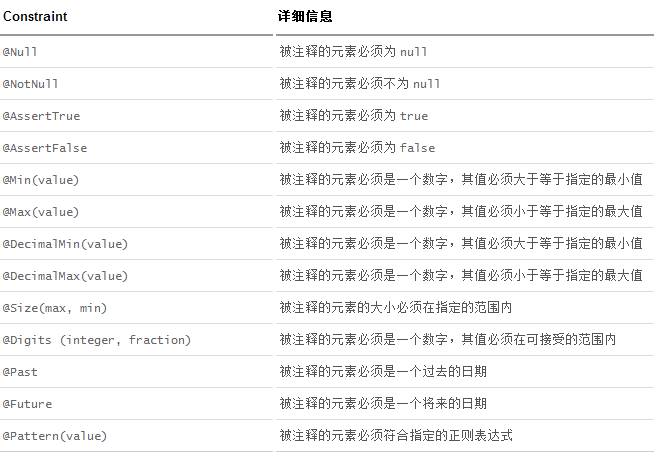
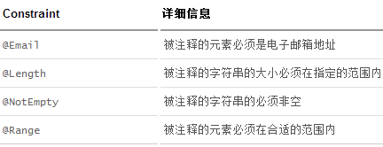

### JSR-303规范bean校验

> 参考：http://blog.didispace.com/spring-boot-learning-21-2-3/#lg=1&slide=1
1. jsr-303标准组成
2. jsr-303使用


#### 1. jsr-303标准组成

1. JSR-303初始
 ```text
 JSR-303 是JAVA EE 6 中的一项子规范，叫做Bean Validation，Hibernate Validator 是 Bean Validation 的参考实现 .
 Hibernate Validator 提供了 JSR 303 规范中所有内置 constraint 的实现，除此之外还有一些附加的 constraint
 ```
2.Bean Validation中内置的constraint
 
 
 
3. Hibernate Validator附加的constraint
      



#### 2. jsr-303使用

第一步：在要校验的字段上添加上@NotNull注解，具体如下：
```java
@Data
@ApiModel(description="用户实体")
public class User {

    @ApiModelProperty("用户编号")
    private Long id;

    @NotNull
    @ApiModelProperty("用户姓名")
    private String name;

    @NotNull
    @ApiModelProperty("用户年龄")
    private Integer age;

}
```

第二步：在需要校验的参数实体前添加@Valid注解，具体如下：
```java
@PostMapping("/")
@ApiOperation(value = "创建用户", notes = "根据User对象创建用户")
public String postUser(@Valid @RequestBody User user) {
    users.put(user.getId(), user);
    return "success";
}
```


