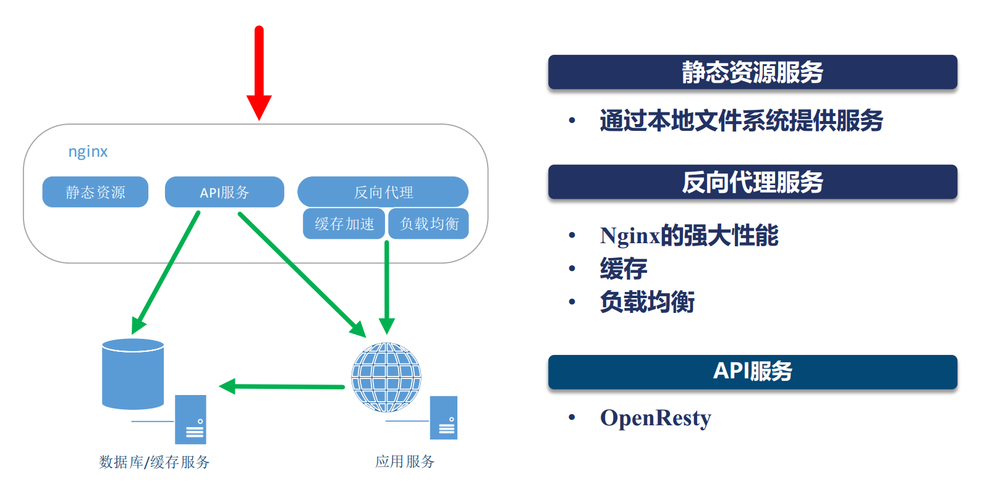

### nginx学习
1. nginx的应用场景
2. nginx简单安装配置

#### 1. nginx的应用场景

1. 静态资源服务：通过本地系统文件提供服务
2. 反向代理服务：nginx强大的性能、缓存、负载均衡
3. API服务： OpenResty

如图：


#### 2. nginx简单安装配置

> docker 镜像搜索：sudo docker search nginx

> docker 镜像拉取：sudo docker pull nginx

> docker 服务启动：docker run -d -p 8080:80 nginx     8080端口的请求会被映射到容器中的80端口服务
> 参数含义：后台运行(-d)、并暴露端口(-p)    -P 随机分配端口

> 访问nginx: http://192.168.12.191:8080/  会访问docker容器的默认目录 /usr/share/nginx/html/index.html

> docker 配置文件的挂载：可以在宿主机中创建文件夹和文件，将容器下  /usr/share/nginx/html、/etc/nginx/nginx.conf、/etc/nginx/conf.d/default.conf
> 复制到自己创建的文件夹下面：然后启动的时候指定参数       -v /data/nginx/html:/usr/share/nginx/html 一一对应
> 挂载好处：避免修改配置文件每次输入docker run -i -t nginx /bin/bash命令进入到镜像终端，直接修改宿主的配置文件就行
 
 
 ```
 docker 权限处理
 docker: Got permission denied while trying to connect to the Docker daemon socket at 
 unix:///var/run/docker.sock: Post http://%2Fvar%2Frun%2Fdocker.sock/v1.40/containers/create:
 dial unix /var/run/docker.sock: connect: permission denied 
 
 处理方法：
 sudo groupadd docker #添加docker用户组
 sudo gpasswd -a $XXX docker #检测当前用户是否已经在docker用户组中，其中XXX为用户名，例如我的，liangll
 sudo gpasswd -a $USER docker #将当前用户添加至docker用户组
 newgrp docker #更新docker用户组
 不处理的话，不然执行docker命令，每次都要输入sudo
```